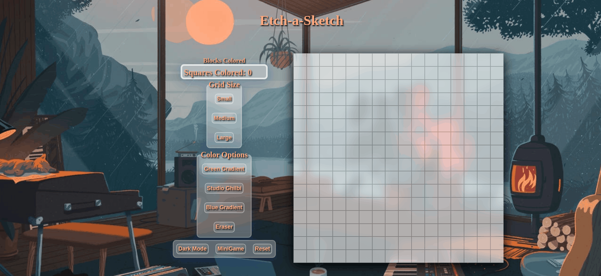

# odin-etchasketch
My Etch A Sketch web app allows users to draw and create various artworks on a grid. It offers several unique key features, such as the ability to count and color the squares, without recounting already-colored ones. The app offers three different grid sizes to choose from, and three coloring modes, including an eraser mode for erasing previous drawings. Additionally, a reset button is available to clear the entire grid. The app also features a dark mode that gives the entirely new theme with the grid having a glowing look, all packaged in an aesthetically pleasing color scheme.

## Summary of Key Features:
* Counting colored block square mode that won't recount squares previously colored
* Three different grid sizes to choose from
* Three different color modes and an eraser mode
* Reset button to clear the grid and start over
* Dark mode that changes the theme and includes a glowing grid for a visually pleasing experience.
* Responsive Design with Breakpoints

<a href="https://hyuncafe.github.io/odin-etchasketch/" target="_blank">Live Link</a>

## TODO:
* Add a fun minigame Mode

## Project Timeline

#### Jan 26, 2023

* Started the project
Created README.md file

#### Jan 27, 2023

* Initialize grid layout project with basic file structure and dependencies
* Create 16x16 grid using div elements and basic CSS styling
* Correct grid alignment and border issues for improved visual clarity
* Upgrade grid size to 50x50 for more granular control and flexibility
* Add background color to enhance visual appeal and highlight grid layout
* Improve overall visual appearance of the grid layout with refined styling and layout adjustments

#### Jan 28, 2023

* feat: Add grid options for 16x16, 30x30, and 50x50 grids
* feat: Add feature buttons for reset and color functionality
* refactor: Change measurement units from em to % for better border fit
* feat: Implement hover save feature for squares
* feat: Add color gradient options for squares
* fix: Correct issue with reset button not applying to color gradients
* feat: Implement dark mode toggle with background image change
* feat: Implement toggle feature to change background image
* refactor: Improve code semantics and readability, run HTML/CSS validators
* docs: Update README.md with clearer project steps for enhanced user experience

#### Jan 29, 2023

* Fix issue with color reset in dark mode
* Correct grid selection impact on square background
* Fix default background color for selected grids without selected colors
* Adjust button styling and add flex for improved user experience
* Correct issue with saved square colors on color reset
* Fix bug with squares not saving in dark mode after reset

#### Jan 30, 2023
* Feature: Added "Eraser mode" to allow users to erase color in grid squares
 * Implemented eraser tool to enable users to remove colors from squares
 * Added UI button to activate/deactivate eraser mode
* Feature: Implemented "Counter" functionality to keep track of painted squares
 * Created counter to keep track of painted squares
 * Displayed count on UI with the ability to reset count
 * Resolved multiple bugs during implementation of the counter feature.

#### Feb 1, 2023
 * Fix: Set default minimum size for counter to 20x20 to prevent shifting on reset
 * Bug: Fix shifting of image/grid on page load and during gameplay

#### Feb 6, 2023
 * Script: Implement barebones version of daily practice program for sharpening coding abilities
  * Add skeleton code for daily blind practice to develop proficiency in programming

#### Feb 9, 2023
 * Refactor: Simplify barebones script by removing displayCount feature
 * Refactor: Convert BBS.js into functions to improve readability and maintenance

#### Feb 11, 2023
 * Refactor code: Replaced nested loops with array methods in barebones script for improved performance and readability.

#### Feb 12, 2023
* Enhance readability: Make variables and functions more readable for better understanding.

#### Feb 20, 2023
* Refactor: Removed unused assets to improve performance
* Style: Improved aesthetics of UI with new design
* Style: Finalized light and dark mode styling for better accessibility

#### March 25, 2023
* Add: Refactor code to be responsive 
* Feat: Added touch feature for the etch a sketch
* Feat: Added Count feature to work with touch
